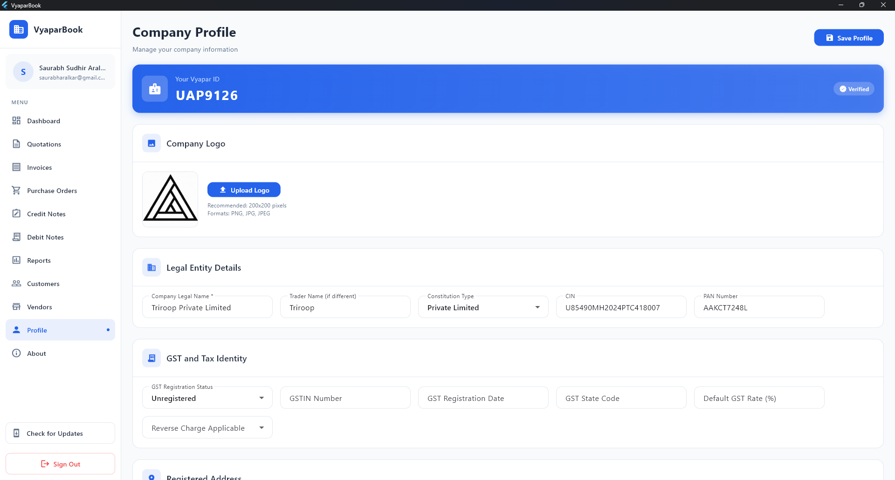
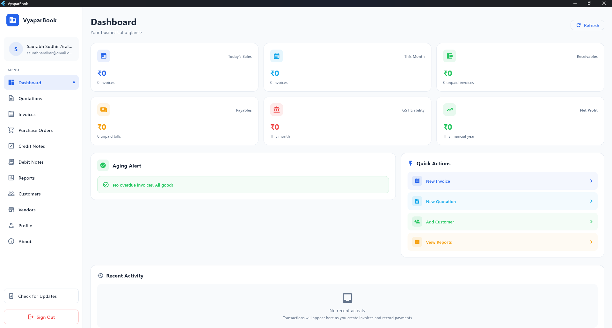
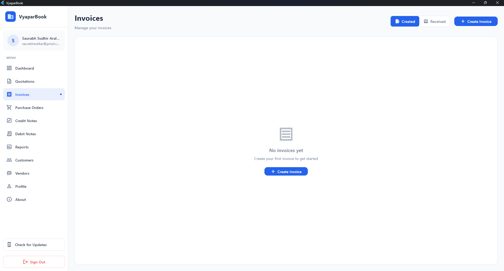
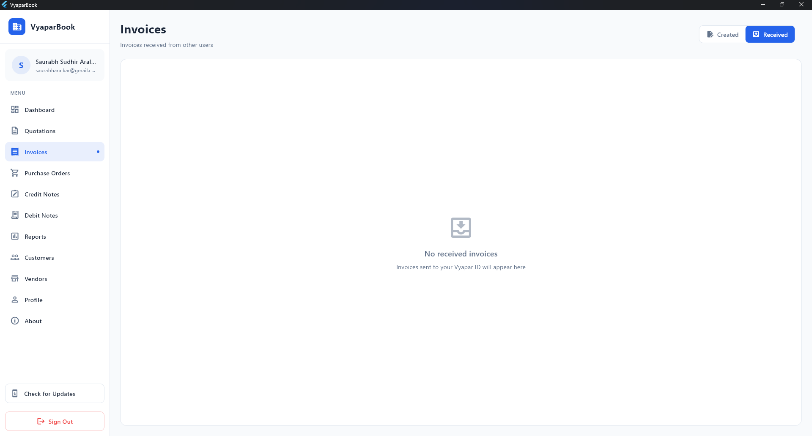
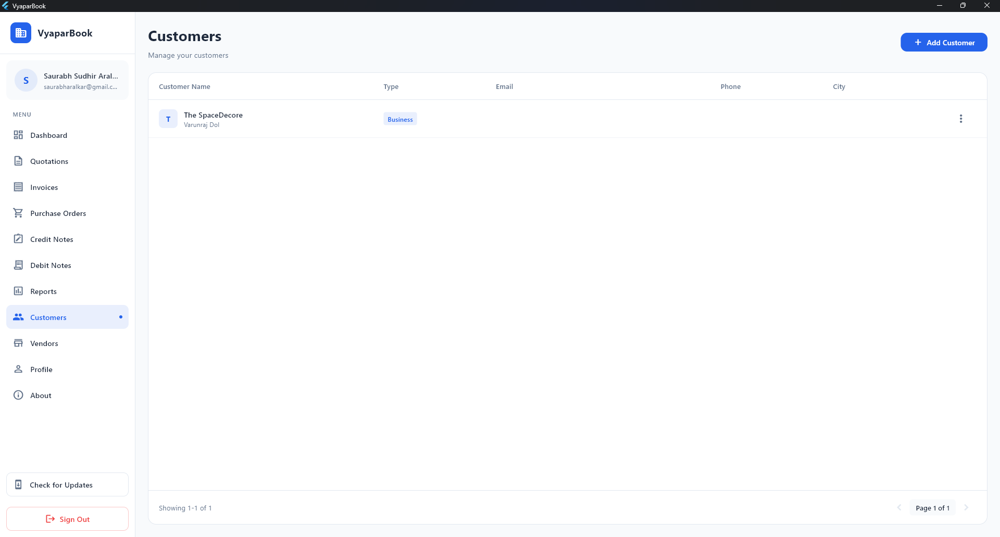
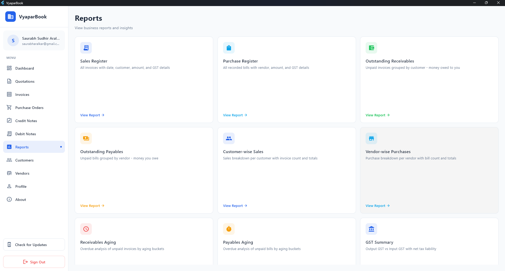

# Vyapar Book

### *Vyapar ka Digital Hisaab* 📒

This is a accounting software that I have developed which is the combination of **Zoho Books and
Tally** along with an innovative feature of **Vyapar ID**. This software was developed from the need
of my friend who owns an Interior Decorating Shop. He was facing difficulty in making Quotations,
Purchase Orders, Invoices, Credit Notes & Debit Notes in the format that a CA can actually find
useful.

---

## Vyapar ID

We have a unique feature of **Vyapar ID** which is a unique id you get at the time of registration
which can then be used to share the documents that you create on the Vyapar Book. This can better be
understood from the example given below.

Suppose you have a vendor who is also a user of Vyapar Book. They also get a Vyapar ID i.e **AAA1111**. Now, if you created a **Purchase Order** for that vendor you will get the option to send that
purchase order to that vendor directly using their Vyapar ID.

This is something which Zoho or Tally does not offer yet.

---

## What Does Vyapar Book Do?

Vyapar Book helps small and medium businesses manage all their financial documents in one place. You
can create Quotations, convert them into Invoices, send Purchase Orders to vendors, handle Credit
Notes & Debit Notes - and all of this in a proper GST-compliant format that your CA will actually
appreciate.

The software also has a built-in **double-entry accounting system** that works silently in the
background. You just do your business actions and the books get maintained automatically.

---

## Features

### Documents You Can Create

- **Quotations** - Send quotes to your customers and convert them to invoices directly
- **Invoices** - GST-compliant invoices with auto-calculated CGST, SGST & IGST
- **Purchase Orders** - Send POs to your vendors directly via their Vyapar ID
- **Credit Notes** - Issue credit notes when a customer returns goods
- **Debit Notes** - Raise debit notes against your vendor for damaged or returned goods

### B2B Document Sharing

This is the feature that makes Vyapar Book stand apart. On every document you create, you get a **"
Send to Vyapar User"** button. Just enter the Vyapar ID of the other party and the document lands
directly in their account. They will see it in their **"Received"** tab.

So if you are a buyer and you receive a Quotation from your vendor, you can directly create a
Purchase Order from it. And if you are a seller and you receive a Purchase Order, you can directly
create an Invoice from it.

### Customers & Vendors

You can manage your complete customer and vendor list. When adding a vendor, you can either enter
their details manually or just search by their **Vyapar ID** and their company details get filled in
automatically.

### GST & Tax Calculations

The software automatically handles:

- **CGST & SGST** for intra-state transactions
- **IGST** for inter-state transactions

All calculations happen based on whether your company and the customer/vendor are in the same state.

### Document Numbering

Every document gets a proper numbered format like `TPL/INV/2025-26/001` where TPL is your company
initials. This is the format CAs and government portals expect.

---

## Reports

Vyapar Book gives you a good set of reports to understand how your business is doing:

- **Sales Register** - All invoices with GST breakup
- **Purchase Register** - All bills from vendors
- **Outstanding Receivables** - Who owes you money and how much
- **Outstanding Payables** - What you owe to your vendors
- **Receivables & Payables Aging** - Overdue analysis by 1-30, 31-60, 60+ days buckets
- **GST Summary** - Output GST vs Input GST, net amount payable
- **Profit & Loss Statement**
- **Balance Sheet**
- **Trial Balance**
- **Ledger Report** - All transactions for any account
- **Cash Book & Bank Book**

---

## How This Helps Your Business

Most small businesses in India are still making invoices in Word or Excel. The moment you grow a
little, that becomes a mess. Vyapar Book solves exactly this:

- Your CA gets documents in a proper format without you having to do anything extra
- You never have to chase a vendor or customer over WhatsApp for a document - just use their Vyapar
  ID
- GST filing becomes much easier because the reports are already in GSTR-1 and GSTR-3B format
- You know exactly which customers owe you money and for how long
- All your books are maintained automatically without you knowing anything about accounting

---

## Technologies Used

| Category       | Technology                           | Purpose                             |
|----------------|--------------------------------------|-------------------------------------|
| Framework      | Flutter (Dart SDK ^3.10.4)           | Cross-platform desktop & web app    |
| Backend        | Firebase Firestore                   | Real-time database & cloud storage  |
| Authentication | Firebase Auth                        | User login & registration           |
| PDF Generation | Firebase Cloud Functions + Puppeteer | Generate professional PDF documents |
| Routing        | GoRouter                             | Navigation & auth-guarded routes    |
| Installer      | Inno Setup                           | Windows executable installer        |

---

## Business Concepts Used

| Concept                       | What It Does in Vyapar Book                                                           |
|-------------------------------|---------------------------------------------------------------------------------------|
| GST Compliance                | Auto-calculates CGST/SGST (intra-state) and IGST (inter-state)                        |
| Double-Entry Bookkeeping      | Every transaction auto-creates journal entries in the background                      |
| Accounts Receivable & Payable | Tracks money owed to you and money you owe                                            |
| Chart of Accounts             | 18-20 accounts auto-created on signup (Assets, Liabilities, Income, Expenses, Equity) |
| Aging Analysis                | Categorizes overdue payments into 1-30, 31-60, 60+ day buckets                        |
| Credit Period & Due Dates     | Invoices have credit period (7/15/30/45/60 days) with auto due date                   |
| B2B Document Flow             | Quotation → Purchase Order → Invoice → Payment → Credit/Debit Note                    |
| Split Payments                | A single payment can be split across Cash and multiple Bank accounts                  |

---

## Operations Concepts Used

| Concept                         | What It Does in Vyapar Book                                                         |
|---------------------------------|-------------------------------------------------------------------------------------|
| Document Numbering              | Format: `PREFIX/TYPE/YYYY-YY/NNN` for every document                                |
| Quotation to Invoice Conversion | One click converts a quotation into an invoice                                      |
| PO from Received Quotation      | Buyer can create PO directly from a vendor's quotation                              |
| Created / Received Toggle       | Every document list shows what you created and what others sent you                 |
| Real-time Updates               | Firestore streams keep data live without manual refresh                             |
| Pagination                      | All list screens paginate at 10 items per page                                      |
| Atomic Transactions             | Invoice creation + journal entry + balance update all happen together or not at all |
| Multi-tenancy                   | Every document is strictly isolated per user with Firestore security rules          |
| Auto Update Checker             | App checks GitHub releases for new versions and shows update notification           |

---

## Download & Try

This is an open-source project and anyone can use it. I have built this to solve a real problem and
also to showcase my development skills. You can download the Windows installer below and try it out.

> *
*[⬇️ Download Vyapar Book for Windows](assets/downloads/MSME Tool.exe)
**

The installer will set up everything. You just need to register with your business details and you
will get your **Vyapar ID** right away.